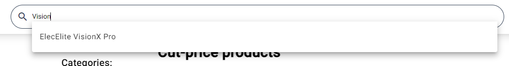
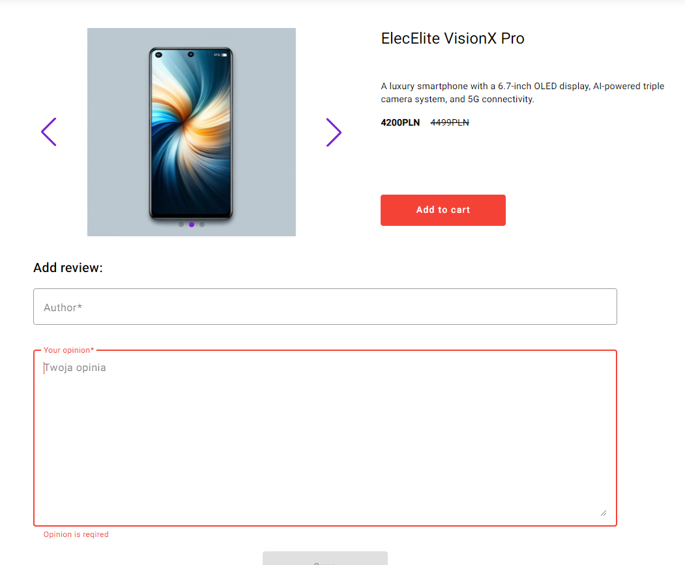
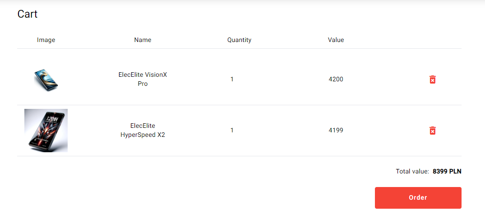
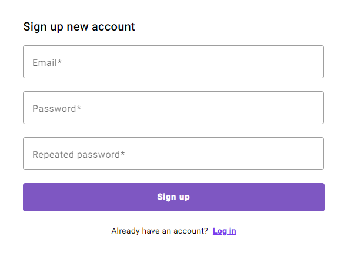
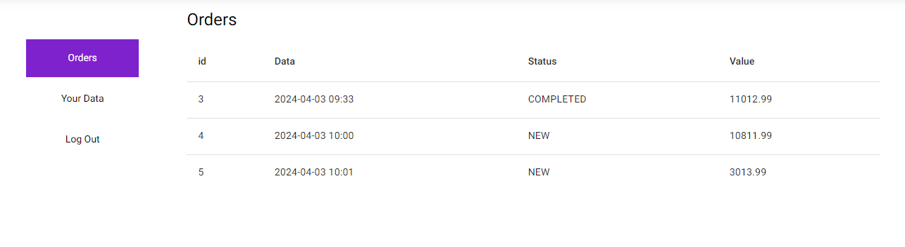
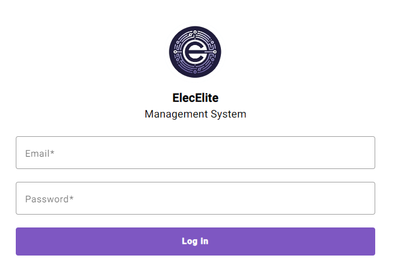
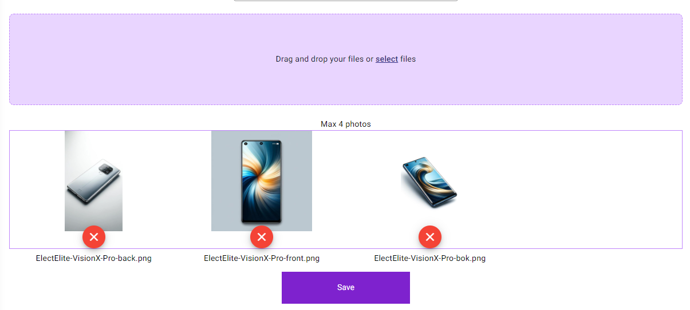
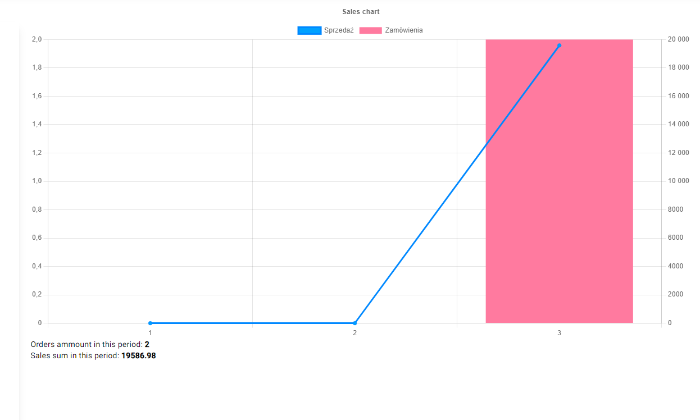

# ElecElite e-commerce electronics shop

> See demo live [click here](https://elecelite.onrender.com/ "click to open link")
Disclaimer: The app is hosted on free 

## Description

The web app contains two parts:

### 1. Main part with shop for clients

- See all products 
- See products by category
- Serach products using search bar with autocomplete

- See product details

- Add comment to product
- Add product to cart
- See products in a cart

- Prepare an order
- You can place an order incognito or by the user account
- Log in for active users.
    you can use existing user
    email: user@user.com
    password: user

- Log out from user account
- Register for new users.

- A user account provides the ability to see all user orders and data, and user data are 
automatically filled in during the order placement process

### 2. Hidden part to manage shop

> available only throught [https://elecelite.onrender.com/admin](https://elecelite.onrender.com/admin "link to shop manager")
You have to login with data:
email: admin
password: test

- Add / edit category
- Add / edit product
- Add / edit image to product with drag & drop option

- See all orders
- Export orders to CSV
- Change order status
- See chart with statistics

## Built using

- Angular 15.1.1
- Typescript 4.8.4
- RxJS 7.5.7
- Tailwind CSS
- Angular Material 15.2.9
- Swiper 11.0.7
- [Backend API](https://github.com/helter88/shopBackend "click to visit Github repository with API")
